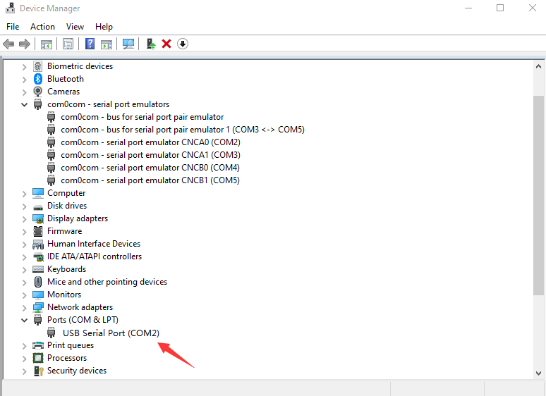

# anxi software help

## 1. install package executable file

### 1.1. requirements

- windows 7 or later

anxi-x.x.x-win32.exe is the installation package of anxi software. Double-click to start the installation program and follow the prompts to complete the installation.

During the installation process, select to create a desktop shortcut. After the installation is complete, the desktop will have an anxi shortcut.

## 2. run

Double-click the anxi shortcut to start the anxi software.

## 3. uninstall

In the control panel, select "Programs and Features", find the anxi software, click the "Uninstall" button, and follow the prompts to complete the uninstall.

## 4. use

anxi software usage.

### 4.1. home page screenshot

### 4.2. Correctly configure the 2000C serial port and the static load machine serial port

In the anxi software, click the "Design Management" menu, select "Device Settings", and configure the 2000C serial port and the static load machine serial port.

### 4.2.1 Correctly configure the 2000C serial port parameters, keep other parameters default, mainly change the serial port number, and change according to the actual situation.

View the 2000C serial port number through the system device manager, and change the 2000C serial port number in the anxi software.

### 4.2.2 Correctly configure the static load machine serial port parameters, keep other parameters default, mainly change the serial port number, and change according to the actual situation.

View the static load machine serial port number through the system device manager, and change the static load machine serial port number in the anxi software.

### 4.3. After correctly configuring the 2000C serial port and the static load machine serial port, click the "Design Management" menu, select "Device Connection", and click.

After successful connection, the anxi software will display "Device connection successful" and the number in the status bar.

### 4.4. Design Management

In the design management, you can modify, export, and import design files.

Take three-point bending as an example, create a new three-point bending design file, click the "New" button, select the "Three-point bending" design type, enter the design name, and click "OK".

Tip: Different design types can only open design files of the corresponding design type.

### 4.5. Experiment execution

In the experiment execution, you can start, stop, and pause the experiment.

Take three-point bending as an example, click the "Start" button to start the three-point bending experiment.

### 4.6. Experiment data

After the experiment is completed, you can view the experiment data.

Click the "Data" button to view the experiment data.

experiment data is displayed in the data table.

### 4.7. Experiment preparation

- Static load machine zeroing
- Static load machine load holding
- Number of cycles reset
  
| Experiment preparation | Description | Other |
| --- | --- | --- |
| Static load machine zeroing | The static load machine is zeroed, and after zeroing, the static load machine remains at zero. | |
| Static load machine load holding | The static load machine is kept at the set load position. |  |
| Number of cycles reset | The number of cycles is reset, and after resetting, the number of cycles starts from zero. | |

### 4.8. Device preparation

- Static load machine up
- Static load machine down
- Static load machine stop

| Device preparation | Description | Other |
| --- | --- | --- |
| Static load machine up | The static load machine is raised. | |
| Static load machine down | The static load machine is lowered. | |
| Static load machine stop | The static load machine is stopped. | |

### 4.9. Experiment execution

- Experiment start
- Experiment pause
- Experiment continue
- Experiment stop
- Experiment interval setting
- Experiment termination condition
- Experiment data

| Experiment execution | Description | Other |
| --- | --- | --- |
| Experiment start | Adjust the static load, start the experiment, and the 2000C starts working. | |
| Experiment pause | Experiment pause, static load machine maintains load, 2000C stops working. | |
| Experiment continue | Experiment continues, static load machine maintains load, 2000C continues working. | |
| Experiment stop | Experiment stop, static load machine maintains load, 2000C stops working. | |
| Experiment interval setting | Experiment interval setting, set the interval time, and the number of intervals. | |
| Experiment termination condition | Maximum number of cycles, frequency dynamic fluctuation range, the experiment stops after reaching the termination condition. | |

### 4.10. Experiment data

In the experiment execution interface, after the experiment is completed, click the "Experiment Data" button to enter the experiment data interface.

Experiment data interface

Configuration parameters - start time, end time, sampling frequency.

| Experiment data | Description |
| --- | --- |
| Start time | Start time of the experiment data, default test data |
| End time | End time of the experiment data, default continuous, the termination condition is the above experiment termination condition or the user clicks the "Stop Experiment" button |
| Sampling frequency | Sampling frequency of the experiment data, default 2 seconds |

Data sampling method - exponential sampling, linear sampling.

| Data sampling method | Description |
| --- | --- |
| Exponential sampling | Exponential sampling, linear sampling. 0.1s 1s 10s ....|
| Linear sampling | Linear sampling, linear sampling.  2s 4s 6s ...|

### 4.11. Keep the load setting parameter

| parameter | Description | Other |
| --- | --- | --- |
| move with distance | move with distance, the static load machine moves with the set distance. | |
| move with speed | move with speed, the static load machine moves with the set speed. | |
