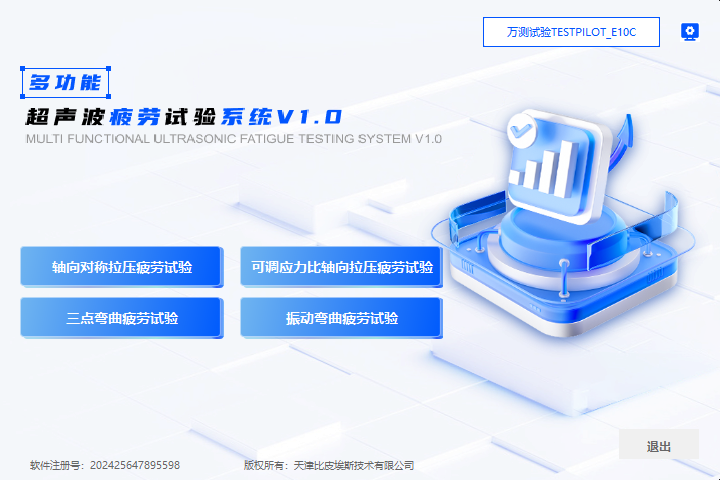
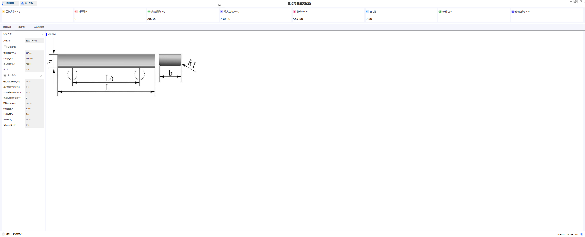
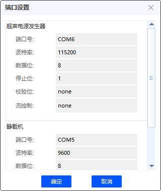
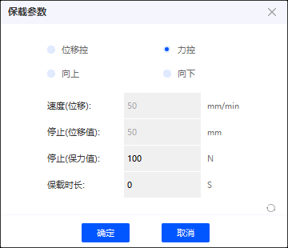

# anxi 软件使用说明

## 1. 安装包

anxi-x.x.x-win32.exe 是 anxi 软件的安装包，双击启动安装程序，按照提示完成安装。

安装过程中，选择创建桌面快捷方式，安装完成后，桌面会出现 anxi 快捷方式。

## 2. 运行

双击 anxi 快捷方式，启动 anxi 软件。

## 3. 卸载

在控制面板中，选择“程序和功能”，找到 anxi 软件，点击“卸载”按钮，按照提示完成卸载。

## 4. 使用

anxi 软件的使用方法。

### 4.1. 首页截图

### 4.1.1. 首页软件配置

1. 首页三方软件配置，首页按钮名称和三方软件入口路径。

### 4.2. 正确配置2000C串口和静载机串口

在 anxi 软件中，点击“设计管理”菜单，选择“设备设置”，配置2000C串口和静载机串口。

- 静载机1.0

- 静载机2.0

### 4.2.1 正确配置2000C串口参数，其他参数保持默认，主要更改串口号，可依据实际情况更改。

通过系统设备管理器查看2000C串口号，更改anxi软件中的2000C串口号。

### 4.2.2 正确配置静载机串口参数，其他参数保持默认，主要更改串口号，可依据实际情况更改。

通过系统设备管理器查看静载机串口号，更改anxi软件中的静载机串口号。

### 4.3. 正确配置2000C串口和静载机串口后，点击“设计管理”菜单，选择“设备连接”，点击。

成功连接后，anxi软件会在状态栏显示“设备连接成功”和数量。

### 4.4. 设计管理

在设计管理中，可以修改、导出、导入设计文件。

以三点弯曲为例，新建三点弯曲设计文件，点击“新建”按钮，选择“三点弯曲”设计类型，输入设计名称，点击“确定”。

提示: 不同设计类型，只能打开对应设计类型的设计文件。

### 4.5. 试验执行

在设计管理中，新建设计文件后，点击“试验执行”按钮，进入试验执行界面。

三点弯曲试验执行界面，包括直方图和数据两个界面。

1. 直方图界面，显示试验过程中采样数据的直方图。
2. 数据界面，显示试验过程中的采样数据。

试验准备 - 静载机清零，静载机保载，循环次数复位。

| 试验准备 | 说明 | 其他 |
| --- | --- | --- |
| 静载机清零 | 静载机清零，清零后，静载机保持在零位。 | |
| 静载机保载 | 静载机保持在设定的载荷位置。 |  |
| 循环次数复位 | 循环次数复位，复位后，循环次数从零开始。 | |

设备准备 - 静载机上升，静载机下降，静载机停止。

| 设备准备 | 说明 | 其他 |
| --- | --- | --- |
| 静载机上升 | 静载机上升，上升距离无限制。用于离试件较远距离作业 | |
| 静载机下降 | 静载机下降，下降距离无限制。 用于离试件较远距离作业 | |
| 静载机停止 | 静载机停止，停止后，静载机保持在当前位置。 | |

试验执行 - 试验开始，试验暂停，试验继续，试验停止。

| 试验执行 | 说明 | 其他 |
| --- | --- | --- |
| 试验开始 | 调整静载载荷，试验开始， 2000C 开始工作 | |
| 试验暂停 | 试验暂停，静载机保持载荷，2000C停止工作 | |
| 试验继续 | 试验继续，静载机保持载荷，2000C继续工作 | |
| 试验停止 | 试验停止，静载机保持载荷，2000C停止工作 | |

试验间断设定 - 试验间断设定，试验间断开始，试验间断结束。 用于试验执行过程中的间断逻辑配置。

| 试验间断设定 | 说明 | 其他 |
| --- | --- | --- |
| 试验间断设定 | 试验间断设定，设定间断时间，间断次数 | |
| 试验间断开始 | 试验间断开始，间断时间到，试验开始 | |
| 试验间断结束 | 试验间断结束，间断时间到，试验继续 | |

试验终止条件 - 最大循环次数，频率动态波动范围，达到终止条件后，试验停止。

| 试验终止条件 | 说明 | 其他 |
| --- | --- | --- |
| 最大循环次数 | 达到最大循环次数后，试验停止 | 试验间断勾选后，次数是统计的激振次数总和，不包括暂停 |
| 频率动态波动范围 | 频率动态波动范围，达到设定范围后，试验停止 | 数据列表第一条的频率为比对参数 |

### 4.6. 试验数据

在试验执行界面，试验结束后，点击“试验数据”按钮，进入试验数据界面。

试验数据界面

配置参数- 开始时间，结束时间，采样频率。

| 试验数据 | 说明 |
| --- | --- |
| 开始时间 | 试验数据开始时间，默认测试即采样数据 |
| 结束时间 | 试验数据结束时间，默认持续进行， 终止条件为 上述试验终止条件或用户单击·停止试验·按钮 |
| 采样频率 | 试验数据采样频率，默认2秒 |

数据取样方式 - 指数取样，线性取样。

| 数据取样方式 | 说明 |
| --- | --- |
| 指数取样 | 指数取样，数据取样方式，指数增长， 0.1s 1s 10s 100s ... |
| 线性取样 | 线性取样，根据采样频率，数据取样方式，线性增长， 2s 4s 6s ... |

数据保存 - 试验因用户单击·停止试验·按钮终止或触发终止条件，数据自动保存在系统C:\Users\{用户名}\AppData\Roaming\anxi\expdata文件夹。

提示: 菜单 设计存储->试验数据。

1. 试验数据记录，显示试验数据csv文件记录列表。
2. 试验摘要，显示左侧选中csv文件的试验数据文件摘要信息。
3. 搜索框按日期条件搜索数据记录文件。
4. 生成报告，生成选中csv文件的试验数据报告word文档。打开报告文件夹。

保载参数- 位移控，力控。

| 保载参数 | 说明 | 其他 |
| --- | --- | --- |
| 位移控 | 速度(位移)，停止（位移值）有效 | 已制定的速度，移动到停止位移值 |
| 力控 | 停止（力值）有效，保载时长| 力值到达力值，并按保载时间持续保持 |

